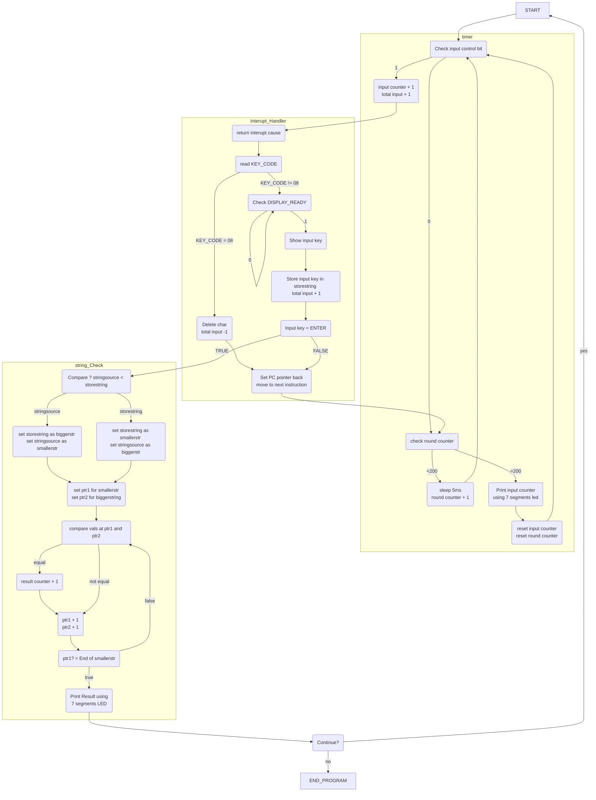
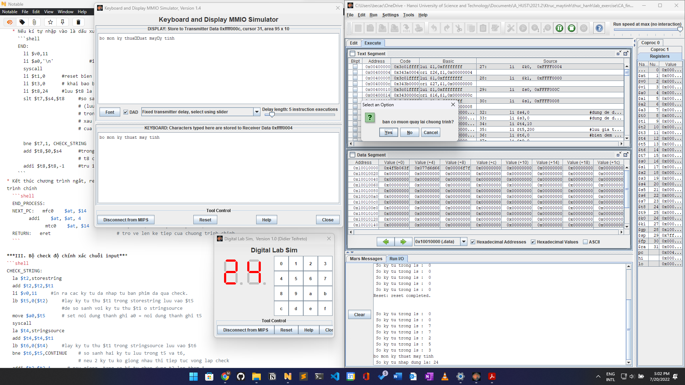
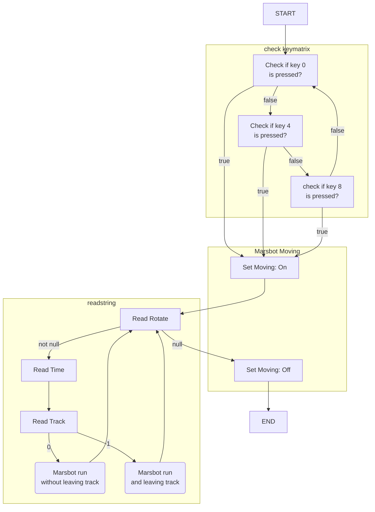
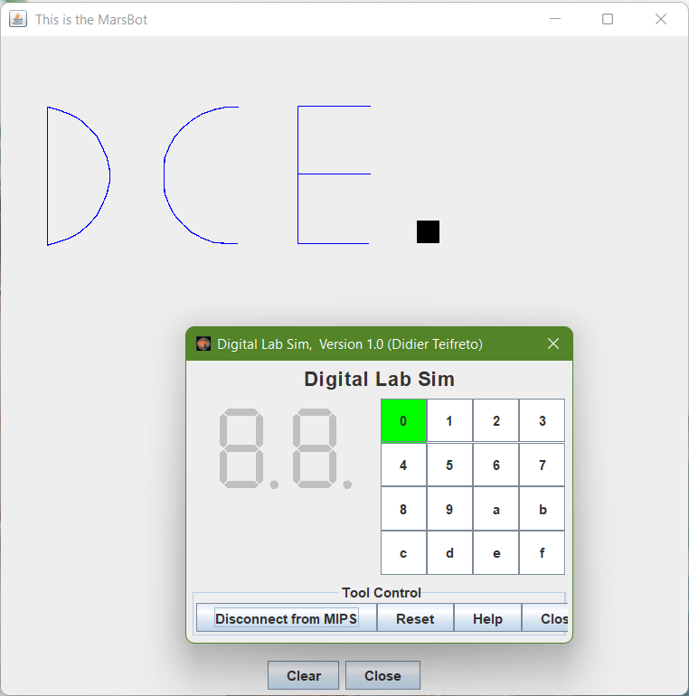
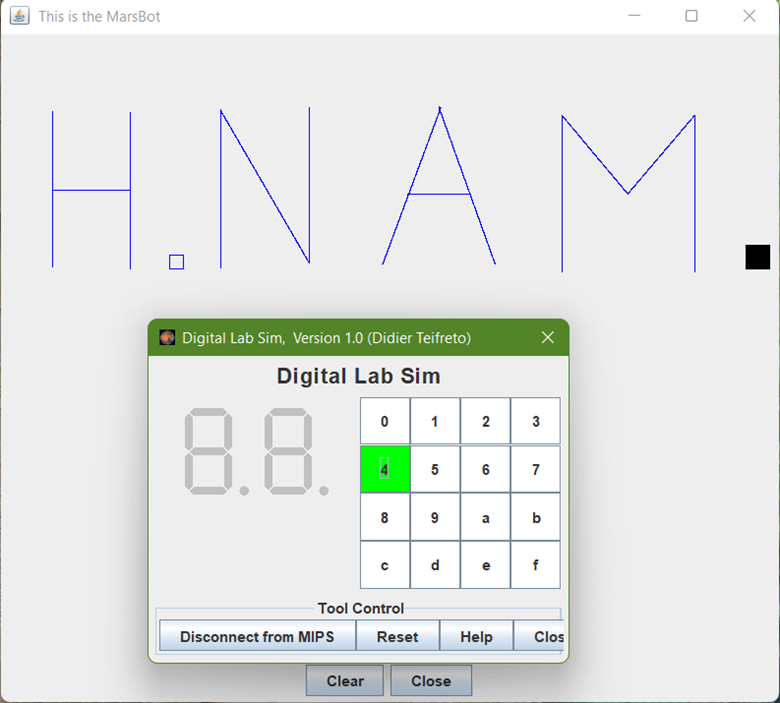
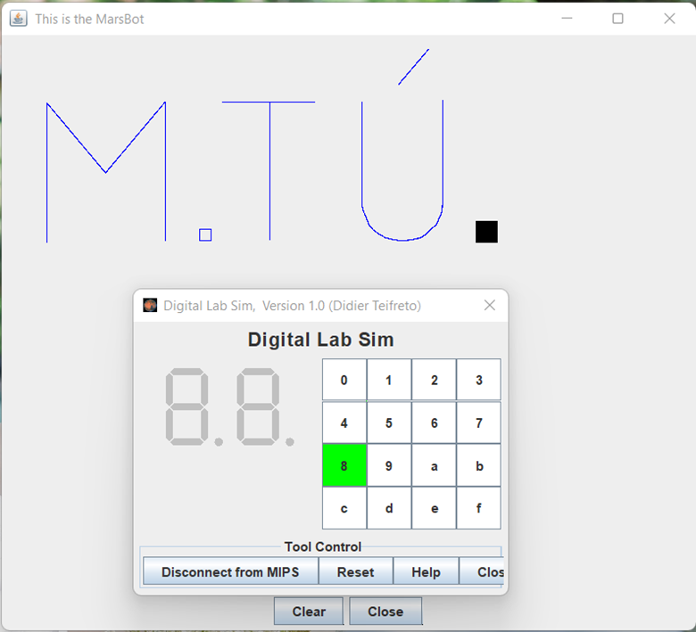

# Báo cáo Bài tập lớn cuối kì
### Bộ môn: Thực hành kiến trúc máy tính
### Nhóm 6:
* Ngô Minh Tú - 20205226
* Hoàng Hải Nam - 20205216

## Câu 3: *"Kiểm tra tốc độ và độ chính xác khi gõ văn bản"*

### Đề bài: 
Chương trình sau sẽ đo tốc độ gõ bàn phím và hiển thị kết quả bằng 2 đèn led 7 đoạn. Nguyên tắc:
- Cho một đoạn văn bản mẫu, cố định sẵn trong mã nguồn. Ví dụ *“bo mon ky thuat may tinh”*
- Sử dụng bộ định thời **Timer** (trong bộ giả lập Digi Lab Sim) để tạo ra khoảng thời gian để đo. Đây là thời gian giữa 2 lần ngắt, chu kì ngắt.
- Trong thời khoảng đó, người dùng nhập các kí tự từ bàn phím. Ví dụ nhập *“bo mOn ky 5huat may tinh”*. Chương trình cần phải đếm số kí tự đúng (trong ví dụ trên thì người dùng gõ sai chữ O và 5) mà người dùng đã gõ và hiển thị lên các đèn led.

### Ý tưởng:
Có 3 chương trình con chính:
  * Bộ đếm số ký tự nhập vào trong 1s:
    * Thực hiện vòng lặp polling, check phần input control bit. 
    * Nếu xuất hiện ký tự nhập vào, counter + 1 -> gọi interupt.
    * Nếu không, check xem số vòng lặp thời gian đếm đã chạm mốc 200 vòng (~ 1s, 1 vòng = 5ms) hay chưa
      * Nếu chưa chạm, tiến hành sleep 5ms (+1 vòng), lặp lại quá trình loop
      * Nếu đã chạm, tiến hành in ra số ký tự counter đã nhập trong 1s đó.
    * reset counter, lặp lại quá trình loop 
  * Ngắt mềm (cho việc nhập chữ từ bàn phím)
    * Vòng lặp đọc ký tự từ địa chỉ **receiver data**
      * Nếu giá trị tại **transmitter control** vẫn là 0 (chưa được lw), tiếp tục lặp
      * Nếu giá trị là 1, hiện các ký tự nhập vào ra display MMIO.
        * Tiến hành lưu ký tự input vào mảng chứa các ký tự
      * Nếu kí tự nhập vào là dấu xuống dòng ('\n') => nhảy tới end của chương trình
  * Bộ check độ chính xác chuỗi input
    * So sánh hai chuỗi: chuỗi nhập vào (lưu tại storestring) và stringsource, so sánh dựa trên chuỗi ngắn hơn
    * Sử dụng hai con trỏ, so sánh song song từng phần tử của hai chuỗi đó
    * Nếu hai ký tự giống nhau (input giống stringsource), tăng biến đếm, nếu không, tiếp tục dịch 2 con trỏ.
    * Vòng lặp so sánh, cho tới khi con trỏ chỏ tới hết chuỗi ngắn hơn
    * In số lượng từ đúng ra led 7 thanh

* Ngoài ra còn có chương trình phục vụ: hiện số trên led 7 thanh 
### Lưu đồ giải thuật


### Tiến hành giải thuật
**A. PART 1**:
* Khai báo trước:
```shell
.eqv SEVENSEG_LEFT    0xFFFF0011 # Dia chi cua den led 7 doan trai	
.eqv SEVENSEG_RIGHT   0xFFFF0010 # Dia chi cua den led 7 doan phai 
.eqv IN_ADRESS_HEXA_KEYBOARD       0xFFFF0012  
.eqv OUT_ADRESS_HEXA_KEYBOARD      0xFFFF0014	
.eqv KEY_CODE   0xFFFF0004         # ASCII code from keyboard, 1 byte 
.eqv KEY_READY  0xFFFF0000        	# =1 if has a new keycode ?                                  
				        # Auto clear after lw  
.eqv DISPLAY_CODE   0xFFFF000C   	# ASCII code to show, 1 byte 
.eqv DISPLAY_READY  0xFFFF0008   	# =1 if the display has already to do  
	                                # Auto clear after sw  
.eqv MASK_CAUSE_KEYBOARD   0x0000034     # Keyboard Cause    
  
.data 
byte_hex_led     : .byte 63,6,91,79,102,109,125,7,127,111 # gia tri cua byte tai 0xFFFF0010 de hien thi t? 0->9
storestring : .space 1000			#khoang trong de luu cac ky tu nhap tu ban phim.
stringsource : .asciiz "bo mon ky thuat may tinh" 
Message: .asciiz "\n So ky tu trong 1s :  "
resultMess: .asciiz  "\n So ky tu nhap dung la: "  
notification: .asciiz "\n ban co muon quay lai chuong trinh? "
```
* Khai báo load các giá trị, các biến:
  ```shell
    li   $k0,  KEY_CODE              
    li   $k1,  KEY_READY                    
    li   $s0, DISPLAY_CODE              
    li   $s1, DISPLAY_READY  	
  MAIN:         
    li $s4,0 			#dung de dem toan bo so ky tu nhap vao
      li $s3,0			#dung de dem so vong lap 
    li $t4,10				
      li $t5,200			#luu gia tri so vong lap. 
    li $t6,0			#bien dem so ky tu nhap duoc trong 1s
    li $t9,0
  ```
**B.PART 2**: 
***I. Bộ đếm số ký tự nhập vào trong 1s***
  * Thực hiện vòng lặp polling, check phần input control bit. 
    ```shell
    LOOP:          
    WAIT_FOR_KEY:  
      lw   $t1, 0($k1)              # $t1 = [$k1] = KEY_READY              
      beq  $t1, $zero,POLLING       # if $t1 == 0 then Polling             
    ```
  * Nếu xuất hiện ký tự nhập vào, counter + 1 -> gọi interupt.
    ```shell
    MAKE_INTER:
      addi $t6,$t6,1    		#tang bien dem ky tu nhap duoc trong 1s len 1
      teqi $t1, 1           # if $t1 = 1 then raise an Interrupt  
    ```
  * Nếu không, check xem số vòng lặp thời gian đếm đã chạm mốc 200 vòng (~ 1s, 1 vòng = 5ms) hay chưa
    ```shell
    POLLING:          
    #neu da lap dk 200 vong( 1s) se nhay den xu ly so ky tu nhap trong 1s.
    addi $s3, $s3, 1     # dem so ky tu nhap vao tu ban phim.
    div $s3,$t5		       #lay so vong lap chia cho 200 de xac dinh da duoc 1s hay chua
    mfhi $t7		         #luu phan du cua phep chia tren
    bne $t7,0,SLEEP		   #neu chua duoc 1s (s3/s5 = 1)nhay den label sleep
                        #neu da duoc 1s thi nhay den nhan SETCOUNT 
                        #de thuc hien in ra man hinh
    ```
    * Nếu chưa chạm, tiến hành sleep 5ms (+1 vòng), lặp lại quá trình loop
      ```shell
      SLEEP:  
        addi    $v0,$zero,32                   
        li      $a0,5     # sleep 5 ms         
        syscall         
        nop           	  # nop la can thiet sau trc khi branch sau syscall          
        b LOOP            # Loop 
      ```
    * Nếu đã chạm, tiến hành in ra số ký tự counter đã nhập trong 1s đó.
      ```shell
      SETCOUNT: # in ra man hinh so chu danh duoc trong 1s
        li $s3,0		#tai lap gia tri cua $s3 ve 0 de 
                    # dem lai so vong lap cho cac lan tiep theo
        li $v0,4		#bat dau chuoi lenh in ra console so ky tu nhap duoc trong 1s
        la $a0,Message
        syscall	
        li    $v0,1            	#in ra so ky tu trong 1s
        add   $a0,$t6,$zero    	# Nhan bien t6 dem so ky nhap duoc trong 1s		
        syscall
      ```
  * reset counter, lặp lại quá trình loop 

***II. Ngắt mềm (cho việc nhập chữ từ bàn phím)***
* Vòng lặp đọc ký tự từ địa chỉ **receiver data**
  ```shell
  .ktext    0x80000180         		#chuong trinh con chay sau khi interupt duoc goi.         
    mfc0  $t1, $13                # cho biet nguyen nhan 
                                  # lam tham chieu dia chi bo nho khong hop
    li    $t2, MASK_CAUSE_KEYBOARD              
    and   $at, $t1,$t2              
    beq   $at,$t2, COUNTER_KETYBOARD              
    j    END_PROCESS  

  COUNTER_KETYBOARD: 
  READ_KEY:  lw   $t0, 0($k0)            		# $t0 = [$k0] = KEY_COD
  ```
  * Nếu giá trị tại **transmitter control** vẫn là 0 (chưa được lw), tiếp tục lặp
    ```shell
    WAIT_FOR_DIS: 
        lw   $t2, 0($s1)            	# $t2 = [$s1] = DISPLAY_READY            
        beq  $t2, $zero, WAIT_FOR_DIS	# if $t2 == 0 then Polling   
    ```
  * Check xem ký tự nhập vào có phải là dấu `BACKSPACE`:
    ```shell
    	beq $t0, 8, DELETE_CHAR  # neu ky hieu nhan vao la phim BACKSPACE, nhảy tới DELETE_CHAR
    
    DELETE_CHAR: # viec xoa ki tu nhap vao tuong duong
	               # voi viec lam giam tong so ky tu nhap vao s4 di 1
	    addi $s4, $s4, -1
	    sb $t0, 0($s0) # tiep tuc toi END_PROCESS
    ```
  * Nếu ký tự nhập vào không phải là `BACKSPACE` và giá trị `DISPLAY_READY` là 1, hiện các ký tự nhập vào ra display MMIO.
    ```shell
    SHOW_KEY: 
      sb $t0, 0($s0)         # hien thi ky tu vua nhap tu ban phim tren man hinh MMIO
                            # luu ky tu input vao mang storestring
      la  $t7,storestring		 # lay $t7 con tro cua chuoi luu chuoi nhap vao
      add $t7,$t7,$s4			   # di chuyen con tro toi vi tri moi
      sb $t0,0($t7)			     # luu lai tu vua nhap
      addi $s4,$s4,1			# tang so luong tu nhap vao
              
      beq $t0,10,END      # Can chu y toi ki hieu xuong dong '\n' - ASCII: 10
      # Neu xuat hien '\n' --> xong input process --> Chuyen toi END
      
      j END_PROCESS
    ```
      * Tiến hành lưu ký tự input vào mảng chứa các ký tự
  * Nếu kí tự nhập vào là dấu xuống dòng ('\n') => nhảy tới end của chương trình
    ```shell
    END:
      li $v0,11         
      li $a0,'\n'         		#in xuong dong
      syscall 
      li $t1,0 			#reset bien dem t1 de dem so ky tu da duoc xet
      li $t3,0      # khai bao bien t3 de dem so ky tu nhap dung
      li $t8,24			#luu $t8 la do dai xau da luu tru trong ma nguon.
      slt $t7,$s4,$t8			#so sanh xem do dai xau nhap tu ban phim 
                          # (luu tai thanh s4) va do dai cua xau co dinh 
                          # trong ma nguon (luu tai t8)
                          # xau nao nho hon thi duyet theo do dai 
                          # cua xau do (s4 < t8 -> t7 = 1; else t7 = 0)
              
      bne $t7,1, CHECK_STRING	
      add $t8,$0,$s4			#trong TH xau input >= xau luu san, 
                          # t8 chua do dai cua sau input
      addi $t8,$t8,-1			#tru 1 vi ky tu cuoi cung la dau enter thi khong can xet.
    ```
* Kết thúc chương trình ngắt, reset lại địa chỉ thanh ghi về chương trình chính, dịch tới lệnh tiếp theo trên chương trình chính
  ```shell
  END_PROCESS:                         
  NEXT_PC:   mfc0    $at, $14	        # $at <= Coproc0.$14 = Coproc0.epc              
        addi    $at, $at, 4	        # $at = $at + 4 (next instruction)              
              mtc0    $at, $14	       	# Coproc0.$14 = Coproc0.epc <= $at  
  RETURN:   eret                       	# tro ve len ke tiep cua chuong trinh chinh
  ```

***III. Bộ check độ chính xác chuỗi input***
```shell
CHECK_STRING:			
	la $t2,storestring
	add $t2,$t2,$t1
	li $v0,11			#in ra cac ky tu da nhap tu ban phim da qua check.
	lb $t5,0($t2)			#lay ky tu thu $t1 trong storestring luu vao $t5 
                    #de so sanh voi ky tu thu $t1 o stringsource
	move $a0,$t5			# set noi dung thanh ghi a0 = noi dung thanh ghi t5
	syscall 
	la $t4,stringsource
	add $t4,$t4,$t1
	lb $t6,0($t4)			#lay ky tu thu $t1 trong stringsource luu vao $t6
	bne $t6,$t5,CONTINUE		# so sanh hai ky tu luu trong t5 va t6, 
                          # neu 2 ky tu ko giong nhau thi tiep tuc vong lap check
	addi $t3,$t3,1			# neu giong, tang so ki tu nhap dung t3 len them 1
```
  * So sánh hai chuỗi: chuỗi nhập vào (lưu tại storestring) và stringsource, so sánh dựa trên chuỗi ngắn hơn
  * Sử dụng hai con trỏ, so sánh song song từng phần tử của hai chuỗi đó
  * Nếu hai ký tự giống nhau (input giống stringsource), tăng biến đếm, nếu không, tiếp tục dịch 2 con trỏ.
    ```shell
    CONTINUE: 
      addi $t1,$t1,1			#sau khi so sanh 1 ky tu, tang bien dem len 
      beq $t1,$t8,PRINT		#neu da duyet het so ky tu can xet 
      # (so luong ki tu cua chuoi nho hon), tien hanh in ket qua ra man hinh
      j CHECK_STRING			#con khong thi tiep tuc xet tiep cac ky tu 
    ```
  * Vòng lặp so sánh, cho tới khi con trỏ chỏ tới hết chuỗi ngắn hơn
  * In số lượng từ đúng ra led 7 thanh
    ```shell
    PRINT:	
      li $v0,4
      la $a0,resultMess
      syscall
      li $v0,1
      add $a0,$0,$t3			# in so tu nhap dung
      syscall	
      li $t9,1			#! thay doi de su dung lai qua trinh display_led o tren
      li $t6,0			# gan lai gia tri bien dem t6
      li $t4,10			# gan lai gia tri so chia = 10 cho t4
      add $t6,$0,$t3
      b DISPLAY_DIGITAL 
    ```
***IV. Hàm in kết quả ra LED 7 thanh***
```shell
DISPLAY_DIGITAL: 
# Hien so chu nhap vao/1s tren 2 thanh led 7 thanh
# Ngoai ra con dc dung de hien so tu go dung khi set ket qua vao thanh ghi t6
	div $t6,$t4		#lay so ky tu nhap duoc trong 1s chia cho 10
	mflo $t7		#luu gia tri phan nguyen, gia tri nay se duoc luu o den LED ben trai
	la $s2,byte_hex_led	#con tro toi array chua cac so hien thi tren led
	add $s2,$s2,$t7		# xac dinh vi tri con tro =  cong them gia tri t7 vao con tro ban dau
	lb $a0,0($s2)           #lay noi dung cho vao $a0           
	jal   SHOW_7SEG_LEFT    # ngay den label den LED trai
#-----------
	mfhi $t7		#luu gia tri phan du cua phep chia
              # gia tri nay se duoc in ra trong den LED ben phai
	la $s2,byte_hex_led			
	add $s2,$s2,$t7
	lb $a0,0($s2)           # set value for segments           
	jal  SHOW_7SEG_RIGHT    # show    
#------------                                          
	li    $t6,0		#reset lai bien dem t6 trc kho quay lại loop
	beq $t9,1,ASK_LOOP 	# bien t9 dung de kiem tra
		# neu display_digital dc dung cho viec hien thi correct input, t9 = 1
		# neu display_digítal dc dung cho viec hien thi so tu nhap vao 1s, t9 = 0 (default)

SHOW_7SEG_LEFT:  
	li   $t0,  SEVENSEG_LEFT 	# gan dia chi cong nhu da khai bao                 
	sb   $a0,  0($t0)        	# gan gia tri moi vao cong                    
	jr   $ra 
	
SHOW_7SEG_RIGHT: 
	li   $t0,  SEVENSEG_RIGHT 	                 
	sb   $a0,  0($t0)         	                
	jr   $ra 
```

**C.KẾT THÚC**
* Hỏi người dùng có muốn thực hiện lại chương trình hay không?
```shell
  ASK_LOOP: # hoi nguoi dung co muon lap lai chuong trinh khong
    li $v0, 50
    la $a0, notification
    syscall
    beq $a0,0,MAIN	# neu co, branch toi main	
    b EXIT
  EXIT: 
  ```
### Hình ảnh minh hoạ


## Câu 4: *"Postscript CNC Marsbot"*

### Đề bài:

Điều khiển Marsbot cắt đúng như hình dạng mong muốn.
Ta nạp vào Marsbot một mảng cấu trúc gồm 3 phần tử:
- ***<Góc chuyển động>***, ***<Thời gian>***, ***<Cắt/Khôngcắt>***
- Trong đó ***<Góc chuyển động>*** là góc của hàm `HEADING` của Marsbot
- ***<Thời gian>*** là thời gian duy trì quá trình vận hành hiện tại
- ***<Cắt/Không cắt>*** thiết lập lưu vết/không lưu vết

Lập trình để CNC Marsbot có thể:
- Thực hiện cắt kim loại như đã mô tả
- Nội dung postscript được lưu trữ cố định bên trong mã nguồn
- Mã nguồn chứa 3 postscript và người dung sử dụng 3 phím `0`, `4`, `8` trên bàn phím KeyMatrix để chọn postscript nào sẽ được gia công.
- Một postscript chứa chữ **DCE** cần gia công. Hai script còn lại sinh viên tự đề xuất (tối thiểu 10 đường cắt)

### Ý tưởng:

1. Tạo 3 postcript gán cho 3 phím 0,4,8 trên KeyMatrix có cấu trúc theo yêu cầu đề bài.
2. Tạo vòng lặp kiểm tra xem phím nào được người dùng nhấn.
3. Nếu người dùng không nhấn 1 trong 3 phím 0,4,8 hoặc nhấn phím khác, vòng lặp tiếp tục.
4. Nếu người dùng chọn 1 trong 3 phím gán, postcript được gán với phím đó sẽ được load vào.
5. Sử dụng vòng lặp để đọc nội dung postcript các giá trị lần lượt là ***góc***, ***thời gian***, ***cắt/không cắt*** và thực thi. Vòng lặp đọc kết thúc khi hết postcript.

### Lưu đồ giải thuật



### Tiến hành giải thuật
**A. PART 1**: 
* Khai báo địa chỉ cho Marsbot, KeyMatrix và 3 postscript để gia công chữ `DCE`, `H.NAM`, `M.TÚ`
```shell
# Mars bot
.eqv HEADING 0xffff8010 
.eqv MOVING 0xffff8050
.eqv LEAVETRACK 0xffff8020
.eqv WHEREX 0xffff8030
.eqv WHEREY 0xffff8040
# Key matrix
.eqv OUT_ADRESS_HEXA_KEYBOARD 0xFFFF0014
.eqv IN_ADRESS_HEXA_KEYBOARD 0xFFFF0012

.data
# (rotate,time,0=untrack | 1=track;)
# numpad 0 -> postscript-DCE
postcript1: .asciiz "90,2000,0;180,3000,0;180,5790,1;80,500,1;70,500,1;60,500,1;50,500,1;40,500,1;30,500,1;20,500,1;10,500,1;0,500,1;350,500,1;340,500,1;330,500,1;320,500,1;310,500,1;300,500,1;290,500,1;280,500,1;90,8000,0;270,500,1;260,500,1;250,500,1;240,500,1;230,500,1;220,500,1;210,500,1;200,500,1;190,500,1;180,500,1;170,500,1;160,500,1;150,500,1;140,500,1;130,500,1;120,500,1;110,500,1;100,500,1;90,500,1;90,5500,0;270,3000,1;0,5800,1;90,3000,1;180,2900,0;270,3000,1;90,3000,0;180,2000,0;90,2000,0;"
# numpad 4 -> postscript-H.NAM 
postcript2: .asciiz "180,9000,0;90,2000,0;0,6000,1;180,3000,0;90,3000,1;0,3000,0;180,6000,1;90,1500,0;90,500,1;0,500,1;270,500,1;180,500,1;90,2000,0;0,6000,1;150,6830,1;0,6000,1;90,2500,0;90,2500,0;200,6400,1;90,4300,0;340,6400,1;200,3500,0;90,2450,1;90,3500,0;180,3000,0;0,6000,1;140,4000,1;40,4000,1;180,6000,1;0,1000,0;90,2000,0;"
# numpad 8 -> postscript-M.TÚ
postcript3: .asciiz "180,9000,0;90,2000,0;0,6000,1;140,4000,1;40,4000,1;180,6000,1;90,1500,0;90,500,1;0,500,1;270,500,1;180,500,1;90,3000,0;0,6000,1;270,2000,0,90,4000,1;90,2000,0;180,4500,1;170,300,1;160,300,1;150,300,1;140,300,1;130,300,1;120,300,1;110,300,1;100,300,1;90,300,1;80,300,1;70,300,1;60,300,1;50,300,1;40,300,1;30,300,1;20,300,1;10,300,1;0,4500,1;270,1900,0;0,700,0;40,2000,1,90,2000,0,180,7500,0"

```

**B. PART 2**: *Xử lý trên KeyMatrix*
* Xét hàng 1, kiểm tra xem nút 0 có được chọn không, nếu có thì gán địa chỉ postscript 1 vào $a1 nếu không thì xét hàng 2
  ```shell
  CHECK_NUMPAD_0:
    li $t5, 0x01 # hàng 1 trong key matrix
    sb $t5, 0($t3) # phải chỉ định lại hàng dự kiến
    lb $a0, 0($t4) # đọc lại giá trị của nút được chọn
    bne $a0, 0x11, CHECK_NUMPAD_4 # nếu không phải là nút không thì kiểm tra hàng tiếp theo
    la $a1, postcript1 # gán địa chỉ của postscript 1 vào $a1
    j RUN
  ```
* Xét hàng 2, kiểm tra xem nút 4 có được chọn không, nếu có thì gán địa chỉ postscript 2 vào $a1 nếu không thì xét hàng 3
  ```shell
    CHECK_NUMPAD_4:
    li $t5, 0x02 
    sb $t5, 0($t3)
    lb $a0, 0($t4)
    bne $a0, 0x12, CHECK_NUMPAD_8
    la $a1, postcript2
    j RUN
  ```
* Xét hàng 3, kiểm tra xem nút 8 có được chọn không, nếu có thì gán địa chỉ postscript 3 vào $a1 nếu không thì quay lại hàng 1
  ```shell
    CHECK_NUMPAD_8:
    li $t5, 0X04 
    sb $t5, 0($t3) 
    lb $a0, 0($t4)
    bne $a0, 0x14, BACK
    la $a1, postcript3
    j RUN
  BACK:	j polling # quay lại đọc cho đến khi một trong 3 số 0,4,8 được chọn
  ```

*MÃ GIẢ:*
```C
*address
	Postcript1, Postcript2, Postcript3
	Row1={0,1,2,3}; Row2={4,5,6,7};Row3={8,9,a,b}
		While(1>0){
			Scanf->a
			If(Row1[0]==a){address = &Postscript1;break;}
			If(Row2[0]==a){address = &Postscript2;break;}
			If(Row3[0]==a){address = &Postscript3;break;}
		}
```

**C. PART 3**: *Xử lý Marsbot*

***i. Chạy Marsbot***
  ```shell
  RUN:
    jal GO

  GO: 
    li $at, MOVING # thay đổi cổng MOVING
    addi $k0, $zero,1 # thành mức logic 1
    sb $k0, 0($at) # để bắt đầu chạy
    jr $ra
  ```

***ii. Đọc postscript***
* Lưu giá trị góc quay và thời gian chuyển động vào $t0, $t1
  ```shell
    addi $t0, $zero, 0 # Lưu giá trị rotate
    addi $t1, $zero, 0 # Lưu giá trị time
  ```
* Đọc góc quay (**READ_ROTATE**):
  ```shell
    READ_ROTATE:
    add $t7, $a1, $t6 # dịch bit ($a1 lưu địa chỉ của postscript)
    lb $t5, 0($t7)  # Đọc kí tự postscript
    beq $t5, 0, END # Kết thúc postscript
    beq $t5, 44, READ_TIME # Gặp dấu "." thì chuyển sang đọc thời gian
    mul $t0, $t0, 10 # Nhân 10 giá trị lúc trước
    addi $t5, $t5, -48 # Chuyển số theo mã ascii về dạng thập phân
    add $t0, $t0, $t5  # Cộng các chữ số
    addi $t6, $t6, 1 # Tăng 1 bit khi dịch chuyển
    j READ_ROTATE # Đọc tiếp kí tự tiếp theo
  ```
  * Nếu **$t5= 0** (end của postscript), nhảy tới END
  ```shell
  END:
    jal STOP
    li $v0, 10
    syscall

  STOP: 
    li $at, MOVING # thay đổi cổng MOVING
    sb $zero, 0($at) # thành mức logic 0
    jr $ra # để dừng chạy
  ```
  * Nếu **$t5 = 44** thì jump đến **READ_TIME** (kí tự `,`có thứ tự 44 trong bảng ascii)

* Đọc thời gian chuyển động (**READ_TIME**)
  ```shell
  READ_TIME:
    add $a0, $t0, $zero # gán góc quay vào a0
    jal ROTATE # quay Marsbot
    addi $t6, $t6, 1 # Tăng 1 bit dịch chuyển
    add $t7, $a1, $t6 # dịch bit
    lb $t5, 0($t7) # Đọc kí tự postscript
    beq $t5, 44, READ_TRACK# Gặp dấu ',' thì chuyển sang đọc trạng thái
    mul $t1, $t1, 10 # Nhân 10 lần giá trị lúc trước
    addi $t5, $t5, -48 # Chuyển số theo bảng ascii về dạng thâp phân
    add $t1, $t1, $t5 # Cộng các chữ số
    j READ_TIME  # Đoc kí tự tiếp theo

    # Hàm quay Marsbot
  ROTATE: 
    li $at, HEADING 
    sw $a0, 0($at) 
    jr $ra
  ```

* Đọc trạng thái (**READ_TRACK**):
  ```shell
  READ_TRACK:
    addi $v0,$zero,32 # Giữ nguyên trạng thái sleep bằng syscall 32
    add $a0, $zero, $t1 # gán thời gian chuyển động vào a0
    addi $t6, $t6, 1 # Tăng 1 bit dịch chuyển
    add $t7, $a1, $t6 # dịch bit
    lb $t5, 0($t7) # Đọc kí tự postscipt
    addi $t5, $t5, -48  # Chuyển số theo mã ascii về dạng thập phân
    beq $t5, $zero, CHECK_UNTRACK # 1 -> track | 0 -> untrack
    jal UNTRACK # dừng cắt nét trước
    jal TRACK # cắt nét tiếp theo
    j NEXT # chuyển sang bước di chuyển tiếp theo

  CHECK_UNTRACK
    jal UNTRACK

  UNTRACK:
    li $at, LEAVETRACK 
    sb $zero, 0($at) 
    jr $ra

  TRACK: 
    li $at, LEAVETRACK 
    addi $k0, $zero,1 
    sb $k0, 0($at) 
    jr $ra
  ```
  * **$t5 = 1** -> để lại dấu
  * **$t5 = 0** -> Không để lại dấu
  * Bỏ qua dấu `,` để chuyển tới vòng đọc tiếp
    ```shell
    NEXT:
      syscall
      addi $t6, $t6, 2 
      j READ_POSTCRIPT
    ```

*MÃ GIẢ*
```c
	P{…}
	a0=0;a1=0;i=0;
	*m;
	While(1>0){
		t0=0;t1=0;
		m = &P[i]
		if (*m == NULL) break;
		else if(*m==’,’) while(1>0){
			a0=t0;
			i++;
			m = &P[i];
			if(*m==’,’){
				a1=t1;
				i++; 
				m = &P[i];
				if(*m=1) printf(“track");
				else if(*m=0) printf(“untrack”);
				i++;
				break;
			}
			t1=t1x10;
			t1=t1+*m;
		}
		else{
		t0 = t0x10;
		t0 = t0 + *m ;
		i++ ;
		}
	}
```
**D. KẾT THÚC CHƯƠNG TRÌNH**
* Dừng Marsbot, hiện thông báo
  ```shell
  END:
    jal STOP
    
  Notification:
	li $v0, 55	#in thong bao
	la $a0, message
	li $a1, 1
	syscall
  ```

### Kết quả

* Khi chọn phím 0



* Khi chọn phím 4



* Khi chọn phím 8



